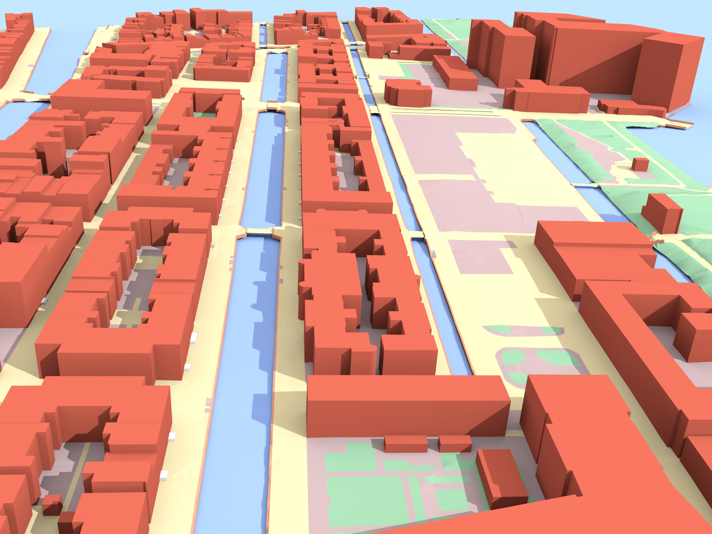

## 3dfier

Takes 2D GIS datasets (e.g. topographical datasets) and "3dfies" them (as in "making them three-dimensional") by lifting every polygon to 3D.
The elevation is obtained from a point cloud (we support LAS/LAZ at this moment), and the semantics of every polygon is used to perform the lifting.
That is, water polygons are extruded to horizontal polygons, buildings to LOD1 blocks, roads as smooth surfaces, etc.
Every polygon is triangulated (constrained Delaunay triangulation) and the lifted polygons are "stitched" together so that one digital surface model (DSM) is constructed.
Our aim is to obtain one DSM that is error-free, i.e. no intersecting triangles, no holes (the surface is watertight), where buildings are integrated in the surface, etc.
This surface will then be used as input in simulation software for instance.

<a href="https://vimeo.com/181421237">This video</a> illustrates the process and what 3dfier is about.

The lifting options can be configured in the [YAML](https://yaml.org/) file provided, an example is provided in `/resources/config_files/myconfig.yml`.
Any 2D input (which should be a planar partition) can be used as input, and each class must be mapped to one of the following:

  1. Building
  1. Terrain
  1. Road
  1. Water
  1. Forest
  1. Bridge
  1. Separation (used for walls and fences)

It is possible to define new classes, although that would require a bit of programming.

Output is in the following formats: OBJ, CityGML, CityJSON, CSV (for buildings only, i.e. their ID and height (ground+roof) are output in a tabular format), PostGIS, and STL.
The ID of each polygon is preserved, and there is a 1-to-1 mapping between the input and the output. 

If you use it, feedback is very much appreciated.

## Documentation
The [3dfier documentation](http://tudelft3d.github.io/3dfier) has extensive information on the installation, usage, and how 3dfier works.

## If you use 3dfier in a scientific context, please cite this article:

Ledoux H, Biljecki B, Dukai B, Kumar K, Peters R, Stoter J, and Commandeur T (2021). 3dfier: automatic reconstruction of 3D city models. *Journal of Open Source Software*, 6(57), 2866. 

## LAS/LAZ Pointcloud

We expect the LAS/LAZ to be classified according to the ASPRS Standard LIDAR Point Classes v1.4 (Table 4.9 of this [PDF](http://www.asprs.org/wp-content/uploads/2010/12/LAS_1-4_R6.pdf)), and at a minimum these should be defined:

  - 0-1: Created, never classified and/or unclassified
  - 2: Ground
  - 3-5: Vegetation

If the vegetation is not classified or not filtered out, then buildings might be taller and there might be artefacts in the terrain.

## Binary releases for Windows and Mac OS X

In order to make easy use of 3dfier we created pre-build binaries which can be downloaded from the [releases page](https://github.com/tudelft3d/3dfier/releases). 

Download the latest release and unzip the archive in a easy to find location, not in the download folder of your browser. 

To be able to quickly test 3dfier one can download the [example dataset](https://github.com/tudelft3d/3dfier/releases/tag/example_data) and unzip the archive in the folder of 3dfier. 

## Test data

In the folder `example_data` (download [example dataset](https://github.com/tudelft3d/3dfier/releases/tag/example_data)) there is a small part of the [BGT datasets](http://www.kadaster.nl/web/Themas/Registraties/BGT.htm) (2D 1:1k topographic datasets of the Netherlands), and a part of the [AHN3 LIDAR dataset](https://www.pdok.nl/nl/ahn3-downloads) that can be used for testing. 
The resulting model (in OBJ) can be found in `example_data/output/test_area.obj`

Further, there is an [open data website](https://3d.bk.tudelft.nl/opendata/3dfier/) that contains 3D models of a few Dutch cities, generated with 3dfier.

## Validate config file
The configuration is stored in [YAML format](http://docs.ansible.com/ansible/latest/YAMLSyntax.html) and needs to be valid for the parser to read the file. 
Config files can be schema validated using [YAML Lint](http://www.yamllint.com)

## Run 3dfier:
**Windows** 
Open a command line (click start and type `command` or `cmd`). Using the command line browse to the folder where you extracted the example files and run:
`3dfier myconfig.yml -o output.ext`

**Mac OS X and Linux**
Open a console. Using the console browse to the folder where you extracted the example files and run:
`$ ./3dfier myconfig.yml --OBJ output.obj`

**Docker**

3dfier offers a alpine base image which tries to give you as much freedom for your vector data source as possible. Vector data is read by GDAL/OGR.

To run 3dfier over Docker simply execute:

    $ docker run --rm --name 3dfier -v <local path where your files are>:/data tudelft3d/3dfier:<tag> 3dfier <name of config file> <... 3dfier parameters>

All your input data needs to be in `<local path where your files are>` and in the config file you need to reference your input data relative to `<local path where your files are>`. To achieve this either move your data and config into `<local path where your files are>` (and subdirectories), or set `<local path where your files are>` to the lowest common ancestor that contains all the data and config files you need.

**Keep in mind that `<local path where your files are>` need to be writable by any user, otherwise your output won't be saved.**

For instance to run it on the example data set (on Linux):

    $ cd 3dfier/example_data
    $ docker run --rm -it -v 3dfier/example_data:/data tudelft3d/3dfier:latest 3dfier testarea_config_unix.yml --OBJ test.obj

There is also a [tutorial](https://github.com/tudelft3d/3dfier/wiki/General-3dfier-tutorial-to-generate-LOD1-models) on how to generate a 3D model with 3dfier.

## Prepare BGT data
For preparing BGT data as input for 3dfier look at [resources/BGT_prepare/ReadMe.md](https://github.com/tudelft3d/3dfier/blob/master/resources/BGT_prepare/ReadMe.md)

