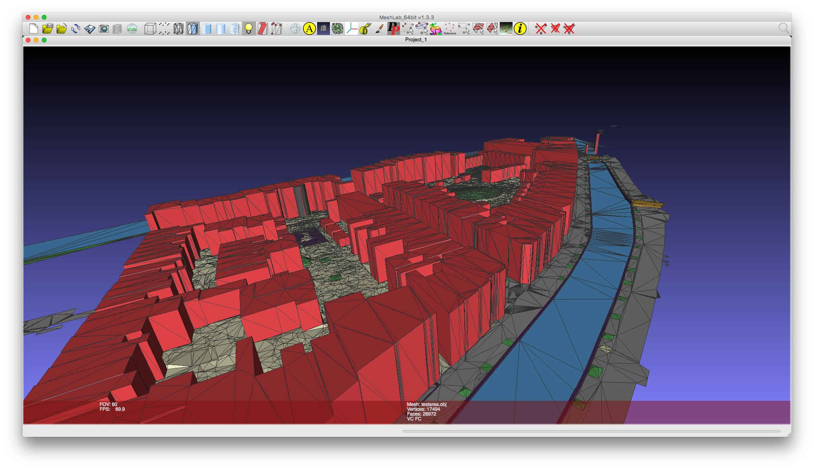

## To run:

`3dfier testarea_config.yml --OBJ out/myoutput.obj`

if you want CityJSON output, change command to `--CityJSON` and run:

`3dfier testarea_config.yml --CityJSON out/myoutput.json`

## 2D input data: the BGT

The files in the folder `bgt` are a crop of the [BGT datasets](http://www.kadaster.nl/web/Themas/Registraties/BGT.htm) in Delft. There were created with the script in `resources/BGT_prepare/..` 

## LIDAR point cloud input: AHN3

The 2 files in the folder `ahn3` are part of the [AHN3](https://www.pdok.nl/nl/ahn3-downloads) cropped for the same area. The 2 tiles used are `c_37en1.laz` and `c_37en2.laz`.

## Example output 

What you should get when you run 3dfier is in `output/testarea.obj` and `output/testarea.json`.
If you use [MeshLab](http://meshlab.sourceforge.net) to visualise the OBJ file, the colours for each class can be activated in the menu `Render/Color/Per Face`. It looks like that:

For CityJSON, use [ninja](https://ninja.cityjson.org).